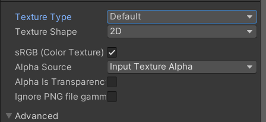

# Read Me

Unityでスプライトをインポートした時に、<br>
<br>
Texture Typeが「Default」になっている。

個人的に「Sprite(2D and UI)」の方が使う機会が多いので、<br>
**「Default」がデフォルトだと面倒くさい！！**<br>
という思いのみで製作した、あまり役に立たないエディタ拡張です。
<hr>

## 使い方

①「Editor」というフォルダをダウンロードする<br>
②「Assets」フォルダにダウンロードしたファイルを入れる<br>
③終わり！！<br>

```
Assets
├Editor
│　 └TextureImporterExtension.cs
```

この様なフォルダ構成になっていたら成功です。
